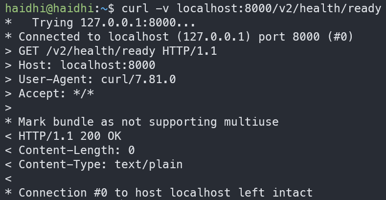
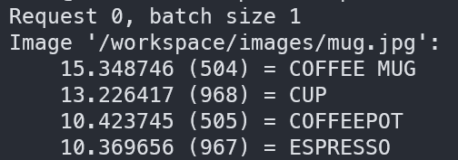

# Triton Server

Triton Inference Server adalah framework Nvidia untu deploy berbagai model AI dari berbagai framework deep learning dan machine learning, termasuk TensorRT, TensorFlow, PyTorch, ONNX, OpenVINO, Python, RAPIDS FIL, dan lainnya. Triton mendukung inferensi di cloud, pusat data, perangkat edge, dan embedded, baik di GPU NVIDIA, CPU x86 dan ARM, maupun AWS Inferentia. Triton Inference Server memberikan performa yang optimal untuk berbagai jenis query, termasuk real-time, batched, ensemble, dan streaming audio/video. Triton Inference Server adalah bagian dari NVIDIA AI Enterprise, sebuah platform perangkat lunak yang mempercepat pipeline data science dan menyederhanakan pengembangan serta deployment AI di lingkungan produksi. 

## Hello Worlds
### Dependencies
Sebelumnya harus pull dua docker image: 
- `nvcr.io/nvidia/tritonserver:24.06-py3` : container server untuk menjalankan tritonserver plus model analyzer
- `nvcr.io/nvidia/tritonserver:24.10-py3-sdk` : container SDK digunakan untuk membuat client dan juga bisa untuk testing model (perf analyzer) 

### Model Repositories
Sebelum menjalankan server kalian harus punya model, model disimpan dengan struktur direktori sebagai berikut: (nama model harus model.onnx) 
```bash
└── model_repository
    ├── densenet_onnx
        ├── 1
        │   └── model.onnx
        ├── config.pbtxt
        └── densenet_labels.txt
```
Model Repositories ini akan kalian simpan di dalam container server. Kalian bisa load banyak model berserta versi-versinya dalam satu Repositories.

contoh: 
```bash 
└── model_repository
    ├── model_1
    │   ├── 1
    │   │   └── model.onnx
    │   ├── config.pbtxt
    │   └── densenet_labels.txt
    └── model_2
        ├── 1
        │   └── model.onnx
        ├── 2   
        │   └── model.onnx  
        └── config.pbtxt
``` 

Setiap model memiliki file konfigurasi `config.pbtxt`. `config.pbtxt` adalah konfigurasi untuk mengatur parameter model, _shape_ _input/output_, _label_, dll. Isi `config.pbtxt` minimal mencakup _backend_, _name_, _shape_, dan _datatype_ 

### Run 
Setelah itu kalian bisa jalankan server nya via docker:
```bash 
docker run --gpus=1 --rm -p8000:8000 -p8001:8001 -p8002:8002 -v/model_repository:/models nvcr.io/nvidia/tritonserver:24.06-py3 tritonserver --model-repository=/models 
```

Make sure kalau server sudah berjalan: 
```bash
curl -v localhost:8000/v2/health/ready
``` 
Kalau server kalian sudah berjalan, maka output command di atas adalah seperti ini: 



Untuk menjalankan inference, buka docker versi sdk via docker juga (kalian akan masuk ke bash) 
```bash
docker run -it --rm --net=host nvcr.io/nvidia/tritonserver:24.10-py3-sdk 
```

Lalu jalankan code client bawaan container: 
```bash
/workspace/install/bin/image_client -m densenet_onnx -c 3 -s INCEPTION /workspace/images/mug.jpg
``` 

Kalian akan dapat output: 


